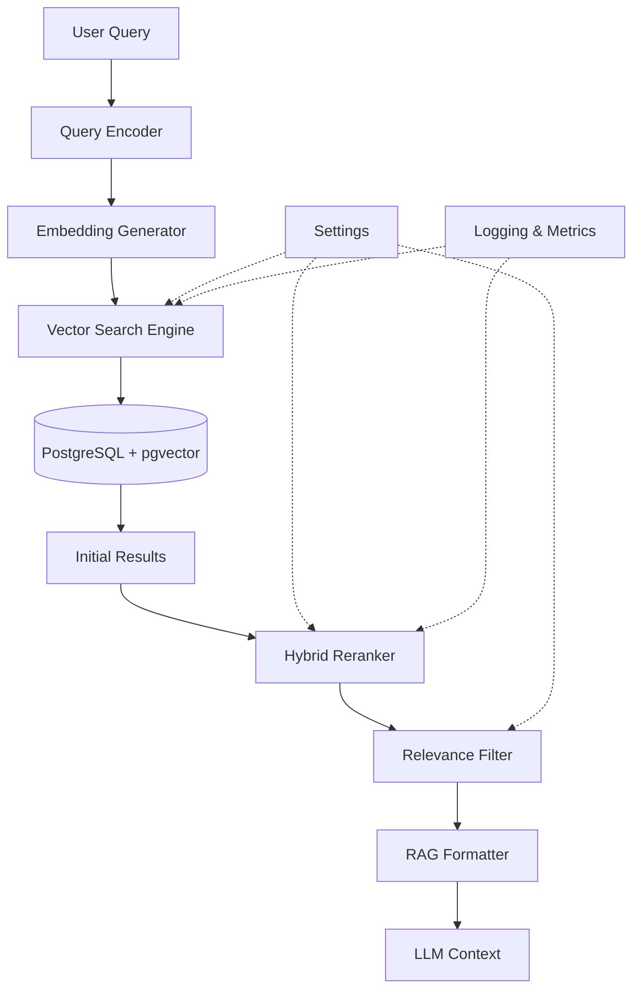

# Design Document: Knowledge Base Retrieval System

## Overview

The Knowledge Base Retrieval System provides semantic search capabilities for RivaAI's telephony-based cognitive voice interface. It enables users to query agricultural, welfare, and education information through natural language in multiple Indian languages. The system uses PostgreSQL with pgvector for vector similarity search, OpenAI text-embedding-3-small (1536 dimensions) for embeddings, and implements hybrid search (vector + keyword) for result reranking to meet strict latency requirements.

The system is designed for low-latency operation (<500ms end-to-end) to support real-time voice conversations, with robust error handling and comprehensive logging for production monitoring.

## Architecture

### High-Level Architecture



### Component Responsibilities

1. **Query Encoder**: Converts natural language queries to embedding vectors
2. **Vector Search Engine**: Performs cosine similarity search using pgvector
3. **Hybrid Reranker**: Reorders results using vector + keyword scoring
4. **Relevance Filter**: Filters results below threshold
5. **RAG Formatter**: Formats results for LLM context injection
6. **Metrics Logger**: Tracks performance and logs warnings

### Data Flow

1. User query (text) → Query Encoder
2. Query text → Embedding Generator → 1536-dim vector
3. Query vector → Vector Search → Top-K candidates from pgvector
4. Candidates → Hybrid Reranker → Reordered results
5. Reordered results → Relevance Filter → Filtered results
6. Filtered results → RAG Formatter → LLM context string

## Components and Interfaces

### 1. RetrievalSystem (Main Interface)

Primary interface for all retrieval operations.

```python
class RetrievalSystem:
    """Main retrieval system interface."""
    
    def __init__(
        self,
        db_pool: DatabasePool,
        embedding_gen: EmbeddingGenerator,
        settings: Settings
    ) -> None:
        """Initialize retrieval system with dependencies."""
        
    async def search(
        self,
        query: str,
        domain: Optional[str] = None,
        top_k: int = 5,
        threshold: Optional[float] = None
    ) -> List[SearchResult]:
        """
        Perform semantic search across knowledge base.
        
        Args:
            query: Natural language query in any supported language
            domain: Optional domain filter ('agriculture', 'welfare', 'education')
            top_k: Number of results to return (1-20)
            threshold: Minimum similarity score (0.0-1.0), defaults to config
            
        Returns:
            List of SearchResult objects sorted by relevance
            
        Raises:
            ValueError: If top_k out of range or threshold invalid
            RetrievalError: If embedding generation or search fails
        """
        
    async def search_batch(
        self,
        queries: List[str],
        domain: Optional[str] = None,
        top_k: int = 5
    ) -> List[List[SearchResult]]:
        """
        Perform batch retrieval for multiple queries.
        
        Args:
            queries: List of natural language queries
            domain: Optional domain filter
            top_k: Number of results per query
            
        Returns:
            List of result lists, one per query (maintains order)
        """
        
    async def format_for_rag(
        self,
        results: List[SearchResult],
        max_tokens: int = 2000
    ) -> str:
        """
        Format search results as LLM context string.
        
        Args:
            results: Search results to format
            max_tokens: Maximum token budget for context
            
        Returns:
            Formatted context string with document delimiters
        """
```

### 2. VectorSearchEngine

Handles pgvector similarity search operations.

```python
class VectorSearchEngine:
    """PostgreSQL + pgvector search engine."""
    
    def __init__(self, db_pool: DatabasePool, settings: Settings) -> None:
        """Initialize search engine."""
        
    async def similarity_search(
        self,
        query_embedding: List[float],
        top_k: int,
        domain: Optional[str] = None,
        threshold: float = 0.0
    ) -> List[RawSearchResult]:
        """
        Perform cosine similarity search using pgvector.
        
        Args:
            query_embedding: 1536-dim query vector
            top_k: Number of results to retrieve
            domain: Optional domain filter
            threshold: Minimum similarity score
            
        Returns:
            List of raw search results with similarity scores
            
        Raises:
            DatabaseError: If search query fails
        """
```

### 3. HybridReranker

Reranks results using vector + keyword scoring.

```python
class HybridReranker:
    """Hybrid reranker using vector + keyword scoring."""
    
    def __init__(self, settings: Settings) -> None:
        """Initialize reranker with scoring weights."""
        
    async def rerank(
        self,
        query: str,
        results: List[RawSearchResult],
        vector_weight: float = 0.7,
        keyword_weight: float = 0.3
    ) -> List[SearchResult]:
        """
        Rerank results using hybrid scoring.
        
        Args:
            query: Original query text
            results: Initial search results
            vector_weight: Weight for vector similarity score
            keyword_weight: Weight for keyword match score
            
        Returns:
            Reranked search results with updated scores
            
        Note:
            Falls back to vector-only scoring if keyword matching fails
        """
        
    def _keyword_score(self, query: str, document: str) -> float:
        """Calculate BM25-style keyword match score."""
```

### 4. SearchResult (Data Model)

Result object returned by retrieval operations.

```python
@dataclass
class SearchResult:
    """Search result with metadata."""
    
    doc_id: str
    content: str
    metadata: Dict[str, Any]
    similarity_score: float  # Original vector similarity (0.0-1.0)
    reranked_score: Optional[float]  # Hybrid reranked score
    domain: str  # 'agriculture', 'welfare', 'education'
    entity_type: str  # 'crop', 'chemical', 'scheme', 'document'
    source_table: str  # Database table name
    
    def to_dict(self) -> Dict[str, Any]:
        """Convert to dictionary for serialization."""
```

### 5. RAGFormatter

Formats results for LLM context injection.

```python
class RAGFormatter:
    """Formats search results for RAG context."""
    
    def format_context(
        self,
        results: List[SearchResult],
        max_tokens: int = 2000,
        template: Optional[str] = None
    ) -> str:
        """
        Format results as LLM context string.
        
        Args:
            results: Search results to format
            max_tokens: Token budget (approx 4 chars/token)
            template: Optional custom formatting template
            
        Returns:
            Formatted context string with clear delimiters
        """
        
    def _estimate_tokens(self, text: str) -> int:
        """Estimate token count (rough: len(text) / 4)."""
```

## Data Models

### Database Schema

The system queries a unified `knowledge_items` table that aggregates all searchable content:

```sql
CREATE TABLE knowledge_items (
    item_id UUID PRIMARY KEY DEFAULT gen_random_uuid(),
    content TEXT NOT NULL,
    embedding vector(1536) NOT NULL,
    metadata JSONB NOT NULL,
    domain VARCHAR(50) NOT NULL,
    entity_type VARCHAR(50) NOT NULL,
    source_table VARCHAR(50) NOT NULL,
    created_at TIMESTAMP DEFAULT NOW(),
    updated_at TIMESTAMP DEFAULT NOW()
);

-- Indexes for performance
CREATE INDEX idx_knowledge_embedding ON knowledge_items 
    USING ivfflat (embedding vector_cosine_ops) 
    WITH (lists = 100);

CREATE INDEX idx_knowledge_domain ON knowledge_items(domain);
CREATE INDEX idx_knowledge_entity_type ON knowledge_items(entity_type);
```

### Entity-Specific Tables

Original entity tables remain for structured queries:

- `crops`: Agricultural crop information
- `chemicals`: Pesticide/fertilizer information with safety limits
- `schemes`: Government welfare/education schemes
- `crop_chemical_relationships`: Crop-chemical relationships
- `crop_weather_requirements`: Weather requirements for crops

### Metadata Structure

Each `knowledge_items` record includes metadata:

```json
{
    "entity_id": "original_table_id",
    "name": "entity_name",
    "local_names": {"hi": "हिंदी नाम", "mr": "मराठी नाव"},
    "type": "crop|chemical|scheme|document",
    "last_updated": "2024-01-15T10:30:00Z",
    "source_file": "optional_source_reference"
}
```

## Correctness Properties


A property is a characteristic or behavior that should hold true across all valid executions of a system—essentially, a formal statement about what the system should do. Properties serve as the bridge between human-readable specifications and machine-verifiable correctness guarantees.

### Property 1: Top-K Similarity Ordering

*For any* query embedding and document set, when performing similarity search with top_k=N, the system should return exactly N documents (or fewer if less than N exist) ordered by descending cosine similarity score.

**Validates: Requirements 1.1, 1.4**

### Property 2: Cosine Similarity Correctness

*For any* query embedding and retrieved documents, the similarity scores returned by the system should match independently calculated cosine similarity values within floating-point precision tolerance (±0.0001).

**Validates: Requirements 1.2**

### Property 3: Consistent Tie-Breaking

*For any* query that returns documents with identical similarity scores, running the same query multiple times should return those documents in the same order (sorted by document ID).

**Validates: Requirements 1.5**

### Property 4: Unified Interface Coverage

*For any* entity type (crop, chemical, scheme, document), the search interface should be able to retrieve and return results of that type when semantically relevant to the query.

**Validates: Requirements 2.1**

### Property 5: Domain Filtering Behavior

*For any* query with a domain filter specified, all returned results should have the specified domain; for any query without a domain filter, results may include documents from any domain.

**Validates: Requirements 2.2, 2.3**

### Property 6: Metadata Completeness

*For any* search result returned by the system, it should contain all required metadata fields: doc_id, content, domain, entity_type, similarity_score, and metadata dictionary.

**Validates: Requirements 2.4**

### Property 7: Entity-Specific Fields Preservation

*For any* search result of a specific entity type (crop, chemical, scheme), the metadata should include entity-specific fields from the original entity table.

**Validates: Requirements 2.5**

### Property 8: Cross-Language Semantic Matching

*For any* pair of semantically equivalent queries in different supported languages, the retrieved documents should have significant overlap (at least 60% of top-5 results should be common).

**Validates: Requirements 3.2, 3.3**

### Property 9: Local Names Searchability

*For any* document with local_names in its metadata, querying using any of those local names should return that document in the results (assuming relevance threshold is met).

**Validates: Requirements 3.4**

### Property 10: Reranking Score Preservation

*For any* search with reranking enabled, each result should contain both the original similarity_score and the reranked_score, and the results should be ordered by reranked_score.

**Validates: Requirements 4.1, 4.3**

### Property 11: Batch Query Order Correspondence

*For any* batch of N queries, the system should return exactly N result lists, where the i-th result list corresponds to the i-th query in the input batch.

**Validates: Requirements 6.1, 6.4**

### Property 12: RAG Context Structure

*For any* non-empty list of search results, the formatted RAG context should be a non-empty string containing all document contents, metadata, and relevance scores with clear delimiters between documents.

**Validates: Requirements 7.1, 7.2, 7.5**

### Property 13: Token Limit Compliance

*For any* token limit specified, the formatted RAG context should not exceed that limit (approximately, using 4 chars/token estimation).

**Validates: Requirements 7.4**

### Property 14: Relevance Threshold Filtering

*For any* relevance threshold T, all returned results should have similarity scores >= T, and any documents with scores < T should be excluded.

**Validates: Requirements 8.1, 8.2**

### Property 15: Input Validation

*For any* invalid input parameters (top_k < 1, top_k > 20, threshold < 0, threshold > 1), the system should raise a ValueError with a descriptive message.

**Validates: Requirements 9.5**

## Error Handling

### Error Categories

1. **Embedding Generation Errors**
   - OpenAI API failures
   - Network timeouts
   - Invalid API keys
   - Rate limiting

2. **Database Errors**
   - Connection failures
   - Query execution errors
   - Transaction failures
   - Timeout errors

3. **Validation Errors**
   - Invalid top_k values
   - Invalid threshold values
   - Invalid domain names
   - Empty queries

4. **Reranking Errors**
   - Keyword extraction failures
   - Scoring computation errors

### Error Handling Strategy

```python
class RetrievalError(Exception):
    """Base exception for retrieval errors."""
    pass

class EmbeddingError(RetrievalError):
    """Embedding generation failed."""
    pass

class DatabaseError(RetrievalError):
    """Database operation failed."""
    pass

class ValidationError(RetrievalError):
    """Input validation failed."""
    pass
```

### Retry Logic

- **Database connections**: Retry up to 3 times with exponential backoff (100ms, 200ms, 400ms)
- **Embedding generation**: Retry up to 2 times with 500ms delay
- **No retry**: Validation errors, reranking errors (fallback instead)

### Fallback Behavior

- **Reranking failure**: Fall back to vector similarity ordering
- **Partial batch failure**: Return results for successful queries, mark failed queries
- **Empty results**: Return empty list (not an error)

### Logging

All errors logged with:
- Error type and message
- Query text (truncated to 100 chars)
- Timestamp
- Stack trace for unexpected errors

## Testing Strategy

### Dual Testing Approach

The system uses both unit tests and property-based tests for comprehensive coverage:

- **Unit tests**: Verify specific examples, edge cases, and error conditions
- **Property tests**: Verify universal properties across randomized inputs

Both approaches are complementary and necessary. Unit tests catch concrete bugs in specific scenarios, while property tests verify general correctness across a wide input space.

### Property-Based Testing Configuration

- **Library**: Hypothesis for Python
- **Iterations**: Minimum 100 examples per property test
- **Test markers**: Each property test tagged with `@pytest.mark.property`
- **Tag format**: `# Feature: knowledge-base-retrieval, Property N: <property_text>`

Each correctness property listed above should be implemented as a single property-based test that validates the property across randomized inputs.

### Unit Testing Focus

Unit tests should focus on:

1. **Specific examples**: Known query-document pairs with expected results
2. **Edge cases**: Empty queries, single-document databases, exact threshold boundaries
3. **Error conditions**: API failures, database disconnections, invalid inputs
4. **Integration points**: Database connection pooling, embedding API calls
5. **Logging verification**: Ensure appropriate log messages are generated

### Test Data Strategy

**For Property Tests:**
- Generate random embeddings (1536-dim vectors with unit norm)
- Generate random document sets with varying sizes
- Generate random queries in supported languages
- Use Hypothesis strategies for valid parameter ranges

**For Unit Tests:**
- Use fixture data with known crops, chemicals, schemes
- Use pre-computed embeddings for deterministic results
- Mock external dependencies (OpenAI API, database)

### Performance Testing

While not part of automated tests, performance should be validated manually:

- Vector search latency: < 300ms for 10 documents
- End-to-end retrieval: < 500ms with reranking
- Batch processing: Linear scaling with query count

### Integration Testing

Integration tests (marked with `@pytest.mark.integration`) should:
- Use real PostgreSQL with pgvector
- Use real OpenAI API (with test API key)
- Verify end-to-end workflows
- Test with multi-language queries

## Implementation Notes

### Database Optimization

1. **pgvector Index**: Use IVFFlat index with appropriate list count
   ```sql
   CREATE INDEX idx_knowledge_embedding ON knowledge_items 
       USING ivfflat (embedding vector_cosine_ops) 
       WITH (lists = 100);
   ```

2. **Connection Pooling**: Reuse existing DatabasePool from config
3. **Query Optimization**: Use prepared statements for repeated queries

### Embedding Optimization

1. **Batch Processing**: Generate embeddings in batches for multiple queries
2. **Caching**: Consider caching frequent query embeddings (future enhancement)
3. **Async Operations**: Use async OpenAI client for non-blocking calls

### Hybrid Reranking Implementation

Phase 1 uses hybrid search (vector + keyword) instead of cross-encoder models to meet latency requirements:

1. **Vector Score**: Cosine similarity from pgvector (weight: 0.7)
2. **Keyword Score**: BM25-style term frequency matching (weight: 0.3)
3. **Combined Score**: `final_score = 0.7 * vector_score + 0.3 * keyword_score`

This approach provides:
- Fast reranking (< 50ms for 10 documents)
- Improved relevance for keyword-heavy queries
- Graceful fallback if keyword matching fails

### Multi-Language Support

The system relies on OpenAI's text-embedding-3-small model, which:
- Supports all target languages (Hindi, Marathi, Telugu, Tamil, Bengali)
- Captures semantic meaning across languages
- Enables cross-language matching without explicit translation

### Latency Budget Allocation

Total budget: 500ms end-to-end

- Embedding generation: 150ms
- Vector search: 200ms
- Reranking: 50ms
- Formatting: 50ms
- Buffer: 50ms

### Monitoring and Observability

Log the following for each retrieval:
- Query text (truncated)
- Number of results
- Latency breakdown (embedding, search, reranking)
- Similarity score distribution
- Number of filtered documents

Expose metrics:
- Retrieval latency (p50, p95, p99)
- Error rates by type
- Cache hit rates (if caching implemented)
- Query volume by domain
