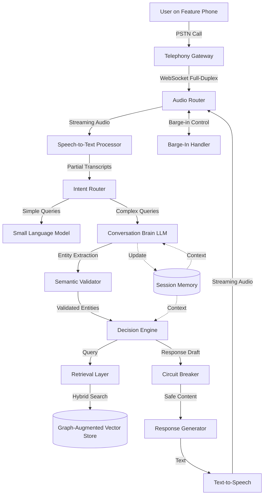

# Design Document: RivaAI - Cognitive Voice Interface for Decision Intelligence

## Overview

RivaAI is a telephony-based cognitive voice interface that provides decision support to users through natural phone conversations. The system is designed for users with basic feature phones in rural environments, requiring no digital literacy. It operates in multiple Indian languages and provides verified, actionable advice across domains including farming, education, and welfare schemes.

The architecture follows a streaming-first approach with full-duplex audio processing, enabling natural conversation flow with barge-in support. Safety is paramount, with circuit breaker mechanisms that can instantly halt harmful outputs. The system uses a hybrid RAG approach combining graph-based knowledge retrieval with vector search to provide contextually rich, verified information.

### Key Design Principles

1. **Latency-Optimized Architecture**: Intent-based routing ensures simple queries get sub-500ms responses while complex decisions complete within 3 seconds
2. **Safety-First Design**: Circuit breaker pattern with pre-generation content filtering prevents harmful outputs before they reach TTS
3. **Privacy-Preserving**: Tokenized session management with automatic PII masking and 24-hour data retention
4. **Graceful Degradation**: Fallback mechanisms at every layer ensure continued operation during component failures
5. **Streaming Everything**: Audio, transcription, and LLM responses all use streaming to minimize perceived latency

## Architecture

### High-Level System Architecture



### Component Interaction Flow

**Typical Call Flow:**
1. User dials helpline → Telephony Gateway establishes WebSocket connection
2. Audio Router manages bidirectional audio streams with barge-in detection
3. STT provides streaming transcription with partial results every 500ms
4. Intent Router classifies query complexity and routes to SLM or main LLM
5. For complex queries: Conversation Brain extracts entities → Semantic Validator checks against Knowledge Base
6. Decision Engine performs hybrid graph+vector retrieval and generates response
7. Circuit Breaker scans response for safety violations before TTS
8. TTS streams audio back through Audio Router to user

### Technology Stack

**Telephony Layer:**
- Twilio/Plivo for PSTN connectivity with WebSocket media streams
- Audio format: μ-law PCM at 8kHz (telephony standard)
- WebSocket protocol for full-duplex streaming

**Speech Processing:**
- STT: Deepgram Nova-2 (streaming latency <300ms, supports Indian languages)
- TTS: ElevenLabs Turbo (streaming synthesis with <500ms first chunk)
- Voice Activity Detection (VAD): WebRTC VAD or Silero VAD
- Audio Transcoding: G.711 µ-law to Linear16 in Turn Manager

**LLM Layer:**
- Main LLM: GPT-4 or Claude 3.5 for complex reasoning
- Small LLM: Groq API (Llama 3.1 8B) for <500ms simple responses and fillers
- Embedding Model: text-embedding-3-large or multilingual-e5-large

**Knowledge Store:**
- Unified Database: PostgreSQL with pgvector extension
- Graph relationships stored as foreign keys in relational schema
- Hybrid retrieval: SQL vector search with JOIN-based graph traversal
- Semantic caching layer with Redis for frequent queries

**Infrastructure:**
- Backend: Python with FastAPI + uvloop for async WebSocket handling (or Node.js/Go for Turn Manager)
- Message Queue: Redis Streams for audio chunk buffering
- Session Store: Redis with 24-hour TTL
- Database: AWS RDS Proxy with connection pooling for 1000+ concurrent calls
- Deployment: Kubernetes for auto-scaling

## Components and Interfaces

### 1. Telephony Gateway

**Responsibility:** Manages PSTN call lifecycle and establishes WebSocket connections for audio streaming.

**Interface:**
```python
class TelephonyGateway:
    def handle_incoming_call(self, caller_ani: str) -> CallSession:
        """
        Answers incoming call and establishes WebSocket connection.
        Returns CallSession with connection details.
        """
        pass
    
    def establish_websocket(self, call_sid: str) -> WebSocketConnection:
        """
        Creates full-duplex WebSocket for audio streaming.
        Audio format: μ-law PCM, 8kHz, 20ms frames.
        """
        pass
    
    def terminate_call(self, call_sid: str) -> None:
        """Gracefully ends call and closes WebSocket."""
        pass
```

**Implementation Notes:**
- Uses Twilio Media Streams API or equivalent
- Handles call state transitions (ringing, answered, ended)
- Implements retry logic for connection failures
- Logs call metadata (duration, ANI, termination reason) without recording audio

### 2. Audio Router

**Responsibility:** Manages bidirectional audio streams and coordinates barge-in detection.

**Interface:**
```python
class AudioRouter:
    def route_incoming_audio(self, audio_chunk: bytes, call_sid: str) -> None:
        """
        Routes incoming audio from user to STT processor.
        Detects speech activity for barge-in handling.
        """
        pass
    
    def route_outgoing_audio(self, audio_chunk: bytes, call_sid: str) -> None:
        """
        Routes TTS audio to user.
        Can be interrupted by barge-in signal.
        """
        pass
    
    def trigger_barge_in(self, call_sid: str) -> None:
        """
        Immediately stops outgoing audio and flushes TTS buffer.
        Signals STT to prioritize incoming audio.
        """
        pass
```

**Implementation Notes:**
- Maintains separate buffers for incoming/outgoing audio
- Uses VAD to detect user speech during system output
- Implements <300ms barge-in latency requirement
- Handles audio chunk buffering with Redis Streams

### 3. Speech-to-Text Processor

**Responsibility:** Converts streaming audio to text with partial transcripts and confidence scoring.

**Interface:**
```python
class SpeechProcessor:
    def process_audio_stream(
        self, 
        audio_stream: AsyncIterator[bytes],
        language_code: str
    ) -> AsyncIterator[TranscriptResult]:
        """
        Streams partial transcripts as audio arrives.
        Yields TranscriptResult with text, confidence, and is_final flag.
        """
        pass
    
    def detect_voice_activity(self, audio_chunk: bytes) -> bool:
        """Returns True if audio contains speech."""
        pass
    
    def get_supported_languages(self) -> List[str]:
        """Returns list of supported language codes."""
        pass
```

**Data Structures:**
```python
@dataclass
class TranscriptResult:
    text: str
    confidence: float  # 0.0 to 1.0
    is_final: bool
    language_code: str
    timestamp: float
```

**Implementation Notes:**
- Uses Deepgram Nova-2 streaming API for low-latency transcription
- Supports languages: hi-IN, mr-IN, te-IN, ta-IN, bn-IN
- Implements enhanced model for noisy environments
- Returns partial results every 300-500ms
- Requests clarification when confidence < 0.6
- Audio transcoding from G.711 µ-law to Linear16 handled by Turn Manager

### 4. Intent Router

**Responsibility:** Classifies query complexity and routes to appropriate LLM (SLM for simple, main LLM for complex).

**Interface:**
```python
class IntentRouter:
    def classify_intent(self, transcript: str, context: SessionContext) -> IntentClassification:
        """
        Determines query complexity and appropriate handler.
        Returns classification with confidence score.
        """
        pass
    
    def route_to_handler(self, intent: IntentClassification) -> ResponseHandler:
        """Returns SLM or main LLM handler based on intent."""
        pass
```

**Data Structures:**
```python
@dataclass
class IntentClassification:
    intent_type: IntentType  # GREETING, CLARIFICATION, COMPLEX_DECISION
    confidence: float
    requires_rag: bool
    estimated_latency_ms: int
    
class IntentType(Enum):
    GREETING = "greeting"  # Edge-cached, <500ms
    CLARIFICATION = "clarification"  # Direct LLM, <1200ms
    COMPLEX_DECISION = "complex_decision"  # RAG + LLM, <3000ms
```

**Implementation Notes:**
- Uses lightweight classifier (fine-tuned BERT or rule-based)
- Caches common greetings/acknowledgments at edge
- Triggers speculative execution for likely RAG queries
- Coordinates SLM fillers during main LLM processing

### 5. Conversation Brain (Main LLM)

**Responsibility:** Manages conversation flow, extracts entities, and generates responses for complex queries.

**Interface:**
```python
class ConversationBrain:
    def process_user_input(
        self,
        transcript: str,
        session_context: SessionContext
    ) -> ConversationResponse:
        """
        Processes user input with conversation history.
        Extracts entities and determines next action.
        """
        pass
    
    def extract_entities(self, transcript: str) -> List[Entity]:
        """Extracts domain-specific entities (crops, schemes, etc.)."""
        pass
    
    def determine_next_action(self, context: SessionContext) -> NextAction:
        """Decides if more info needed or ready for decision."""
        pass
```

**Data Structures:**
```python
@dataclass
class ConversationResponse:
    response_text: str
    extracted_entities: List[Entity]
    next_action: NextAction
    confidence: float
    requires_validation: bool

@dataclass
class Entity:
    entity_type: str  # "crop", "chemical", "scheme", "amount"
    value: str
    confidence: float
    requires_semantic_validation: bool

class NextAction(Enum):
    ASK_CLARIFICATION = "ask_clarification"
    PROCEED_TO_DECISION = "proceed_to_decision"
    ESCALATE_TO_HUMAN = "escalate_to_human"
```

**System Prompt:**
Uses the system prompt defined in requirements document with strict constraints on simplicity, safety, and cultural sensitivity.

**Implementation Notes:**
- Uses GPT-4 or Claude 3.5 with streaming responses
- Maintains conversation history in session context
- Implements one-question-at-a-time pattern
- Triggers [STOP_DANGER] token for safety escalation

### 6. Semantic Validator

**Responsibility:** Validates extracted entities against Knowledge Base to prevent acting on misheard information.

**Interface:**
```python
class SemanticValidator:
    def validate_entities(
        self,
        entities: List[Entity],
        domain: str
    ) -> ValidationResult:
        """
        Checks entities against Knowledge Base.
        Returns validation result with corrections if needed.
        """
        pass
    
    def check_safety_bounds(self, entity: Entity) -> bool:
        """
        Validates numeric values against safety limits.
        E.g., pesticide amounts, dosages.
        """
        pass
```

**Data Structures:**
```python
@dataclass
class ValidationResult:
    is_valid: bool
    validated_entities: List[Entity]
    corrections: List[Correction]
    confidence: float

@dataclass
class Correction:
    original_value: str
    suggested_value: str
    reason: str
```

**Implementation Notes:**
- Fuzzy matches entity values against Knowledge Base
- Checks numeric values against safety bounds (e.g., pesticide limits)
- Requests user confirmation for low-confidence entities
- Critical for preventing dangerous misunderstandings

### 7. Decision Engine with RAG

**Responsibility:** Retrieves verified information and generates evidence-based decisions.

**Interface:**
```python
class DecisionEngine:
    def generate_decision(
        self,
        validated_entities: List[Entity],
        user_query: str,
        session_context: SessionContext
    ) -> Decision:
        """
        Performs hybrid retrieval and generates decision.
        Returns decision with evidence and confidence.
        """
        pass
    
    def retrieve_context(
        self,
        query: str,
        entities: List[Entity]
    ) -> RetrievalResult:
        """
        Performs graph-augmented vector search.
        Returns relevant documents and related entities.
        """
        pass
```

**Data Structures:**
```python
@dataclass
class Decision:
    decision_text: str
    evidence: List[str]  # Source documents
    confidence: float
    related_entities: List[Entity]
    requires_human_review: bool

@dataclass
class RetrievalResult:
    documents: List[Document]
    related_entities: List[Entity]
    graph_paths: List[GraphPath]
    relevance_score: float
```

**Implementation Notes:**
- Uses hybrid retrieval: vector search + graph traversal
- Implements speculative execution on partial transcripts
- Caches frequently accessed knowledge
- Falls back to cached data if retrieval fails

### 8. Retrieval Layer (Unified PostgreSQL Store with pgvector)

**Responsibility:** Performs hybrid search combining semantic similarity and relational graph traversal in a unified PostgreSQL database.

**Interface:**
```python
class RetrievalLayer:
    def hybrid_search(
        self,
        query_embedding: List[float],
        entities: List[Entity],
        top_k: int = 5
    ) -> List[Document]:
        """
        Combines vector similarity search with JOIN-based graph traversal.
        Returns documents enriched with related entities.
        Uses SQL: ORDER BY embedding <-> query_embedding with JOINs.
        """
        pass
    
    def get_related_entities(
        self,
        entity: Entity,
        relationship_types: List[str]
    ) -> List[Entity]:
        """
        Traverses knowledge graph via foreign key relationships.
        E.g., "Wheat" → "soil moisture", "pesticide limits"
        """
        pass
    
    def check_semantic_cache(self, query_hash: str) -> Optional[List[Document]]:
        """
        Checks Redis semantic cache before hitting database.
        Returns cached results if available.
        """
        pass
```

**PostgreSQL Schema:**
```sql
-- Core entity tables
CREATE TABLE crops (
    id SERIAL PRIMARY KEY,
    name VARCHAR(255),
    local_names JSONB,
    season VARCHAR(50),
    region VARCHAR(100),
    embedding vector(1536)  -- pgvector type
);

CREATE TABLE chemicals (
    id SERIAL PRIMARY KEY,
    name VARCHAR(255),
    type VARCHAR(50),
    safe_dosage_min FLOAT,
    safe_dosage_max FLOAT,
    unit VARCHAR(20),
    safety_warnings JSONB,
    embedding vector(1536)
);

CREATE TABLE schemes (
    id SERIAL PRIMARY KEY,
    name VARCHAR(255),
    local_names JSONB,
    eligibility_criteria JSONB,
    required_documents JSONB,
    application_process TEXT,
    contact_info JSONB,
    last_updated TIMESTAMP,
    embedding vector(1536)
);

-- Relationship tables (graph as foreign keys)
CREATE TABLE crop_chemical_relationships (
    crop_id INTEGER REFERENCES crops(id),
    chemical_id INTEGER REFERENCES chemicals(id),
    relationship_type VARCHAR(50),  -- 'SAFE_FOR', 'REQUIRES'
    dosage_recommendation VARCHAR(255),
    PRIMARY KEY (crop_id, chemical_id)
);

CREATE TABLE crop_weather_requirements (
    crop_id INTEGER REFERENCES crops(id),
    weather_condition VARCHAR(100),
    requirement_details JSONB
);

-- Vector search index
CREATE INDEX ON crops USING ivfflat (embedding vector_cosine_ops);
CREATE INDEX ON chemicals USING ivfflat (embedding vector_cosine_ops);
CREATE INDEX ON schemes USING ivfflat (embedding vector_cosine_ops);
```

**Implementation Notes:**
- PostgreSQL with pgvector extension for unified storage
- Graph relationships stored as foreign keys (no separate graph DB)
- Hybrid scoring: 0.6 * vector_score + 0.4 * relationship_score
- Implements 2-hop JOIN traversal for related entities
- Semantic caching in Redis for frequent queries
- AWS RDS Proxy for connection pooling (handles 1000+ concurrent calls)

### 9. Circuit Breaker

**Responsibility:** Scans generated responses for harmful content and instantly halts output if detected.

**Interface:**
```python
class CircuitBreaker:
    def scan_response(self, response_text: str) -> SafetyCheckResult:
        """
        Scans response for harmful content before TTS.
        Returns safety check result with action.
        """
        pass
    
    def check_blacklist(self, response_text: str) -> bool:
        """Checks against high-risk topic blacklist."""
        pass
    
    def trigger_safety_message(self, call_sid: str, reason: str) -> None:
        """Plays pre-recorded safety message and escalates."""
        pass
```

**Data Structures:**
```python
@dataclass
class SafetyCheckResult:
    is_safe: bool
    action: SafetyAction
    reason: str
    confidence: float

class SafetyAction(Enum):
    ALLOW = "allow"
    BLOCK_AND_ESCALATE = "block_and_escalate"
    PLAY_SAFETY_MESSAGE = "play_safety_message"
```

**Safety Rules:**
- Blacklist topics: suicide methods, self-harm, dangerous chemical misuse
- Content filters: violence, hate speech, medical advice
- Dosage validation: flags amounts outside safe ranges
- Instant halt: <100ms from detection to audio stop

**Implementation Notes:**
- Uses lightweight classifier for real-time scanning
- Maintains blacklist of high-risk keywords/patterns
- Pre-recorded safety messages in all supported languages
- Logs all circuit breaker triggers for review

### 10. Response Generator

**Responsibility:** Formats LLM outputs into clear, actionable responses optimized for voice.

**Interface:**
```python
class ResponseGenerator:
    def format_for_voice(
        self,
        decision: Decision,
        user_context: SessionContext
    ) -> str:
        """
        Formats decision into voice-optimized response.
        Applies constraints: <40 tokens, simple language.
        """
        pass
    
    def add_confidence_disclaimer(self, response: str, confidence: float) -> str:
        """Adds uncertainty disclaimer if confidence < 0.8."""
        pass
```

**Formatting Rules:**
- Maximum 40 tokens per response
- Short sentences (<15 words)
- No lists or bullet points (voice-unfriendly)
- Includes confidence disclaimers when needed
- Uses culturally appropriate language

### 11. Text-to-Speech Processor

**Responsibility:** Converts text responses to natural-sounding speech with streaming output.

**Interface:**
```python
class TextToSpeechProcessor:
    def synthesize_speech_stream(
        self,
        text: str,
        language_code: str,
        voice_config: VoiceConfig
    ) -> AsyncIterator[bytes]:
        """
        Streams audio chunks as synthesis progresses.
        First chunk arrives within 800ms.
        """
        pass
```

**Implementation Notes:**
- Uses ElevenLabs Turbo for streaming synthesis
- Streaming synthesis for low latency with first chunk <500ms
- Natural-sounding voices for each language
- Audio format: μ-law PCM at 8kHz for telephony
- Implements Optimistic TTS Pipeline: parallel safety check + audio buffering

### 12. Session Memory

**Responsibility:** Manages conversation state with privacy-preserving persistence.

**Interface:**
```python
class SessionMemory:
    def create_session(self, caller_ani: str) -> SessionContext:
        """Creates new session with 24-hour TTL."""
        pass
    
    def update_session(self, session_id: str, context: SessionContext) -> None:
        """Updates session with new conversation state."""
        pass
    
    def resume_session(self, caller_ani: str) -> Optional[SessionContext]:
        """Retrieves session if exists and not expired."""
        pass
    
    def mask_pii(self, text: str) -> str:
        """Tokenizes PII using NER-based detection."""
        pass
```

**Data Structures:**
```python
@dataclass
class SessionContext:
    session_id: str
    caller_ani_hash: str  # Hashed, not plaintext
    conversation_history: List[Turn]
    extracted_entities: List[Entity]
    domain: str
    language_code: str
    created_at: datetime
    last_updated: datetime
    
@dataclass
class Turn:
    speaker: str  # "user" or "system"
    text: str  # PII masked
    timestamp: datetime
```

**Privacy Implementation:**
- ANI stored as SHA-256 hash
- PII masked using NER (names, phone numbers, addresses)
- 24-hour TTL with automatic purge
- Encrypted at rest using AES-256
- Anonymized patterns retained for system improvement

### 13. Barge-In Handler

**Responsibility:** Detects user speech during system output and interrupts immediately.

**Interface:**
```python
class BargeInHandler:
    def monitor_user_audio(
        self,
        audio_stream: AsyncIterator[bytes],
        is_system_speaking: bool
    ) -> None:
        """
        Monitors for user speech during system output.
        Triggers barge-in if detected.
        """
        pass
    
    def trigger_interrupt(self, call_sid: str) -> None:
        """
        Stops TTS output and flushes audio buffer.
        Latency requirement: <300ms.
        """
        pass
```

**Implementation Notes:**
- Uses VAD to detect speech onset
- Implements <300ms interrupt latency
- Flushes TTS buffer and stops audio output
- Signals STT to prioritize incoming audio

### 14. Small Language Model (SLM)

**Responsibility:** Handles simple conversational turns and provides fillers during main LLM processing.

**Interface:**
```python
class SmallLanguageModel:
    def generate_simple_response(
        self,
        user_input: str,
        intent: IntentType
    ) -> str:
        """
        Generates response for simple intents.
        Latency: <500ms.
        """
        pass
    
    def generate_filler(self, context: str) -> str:
        """
        Generates contextual filler while main LLM processes.
        E.g., "Let me check the farming guidelines for you..."
        """
        pass
```

**Implementation Notes:**
- Uses Groq API for ultra-fast inference (<500ms)
- Handles 80% of simple conversational turns
- Provides immediate acknowledgment
- Coordinates with main LLM for complex queries
- Implements semantic caching in Redis for frequent patterns

## Data Models

### Core Domain Models

```python
@dataclass
class CallSession:
    call_sid: str
    caller_ani_hash: str
    session_id: str
    websocket_url: str
    status: CallStatus
    started_at: datetime
    ended_at: Optional[datetime]
    
class CallStatus(Enum):
    RINGING = "ringing"
    ANSWERED = "answered"
    IN_PROGRESS = "in_progress"
    ENDED = "ended"
    FAILED = "failed"

@dataclass
class AudioChunk:
    call_sid: str
    audio_data: bytes  # μ-law PCM
    timestamp: float
    sequence_number: int
    direction: AudioDirection
    
class AudioDirection(Enum):
    INCOMING = "incoming"  # User to system
    OUTGOING = "outgoing"  # System to user

@dataclass
class Document:
    doc_id: str
    content: str
    metadata: Dict[str, Any]
    embedding: List[float]
    source: str
    domain: str
    last_updated: datetime
    relevance_score: float

@dataclass
class GraphPath:
    start_entity: Entity
    end_entity: Entity
    relationships: List[Relationship]
    path_score: float

@dataclass
class Relationship:
    relationship_type: str
    properties: Dict[str, Any]
    confidence: float

@dataclass
class VoiceConfig:
    language_code: str
    voice_name: str
    speaking_rate: float  # 0.8 to 1.2
    pitch: float  # -20.0 to 20.0
```

### Knowledge Base Schema

```python
@dataclass
class CropKnowledge:
    crop_name: str
    local_names: List[str]
    season: str
    region: str
    soil_requirements: str
    water_requirements: str
    common_pests: List[str]
    recommended_chemicals: List[ChemicalInfo]
    
@dataclass
class ChemicalInfo:
    chemical_name: str
    type: str  # pesticide, fertilizer, etc.
    safe_dosage_range: Tuple[float, float]
    unit: str
    safety_warnings: List[str]
    
@dataclass
class WelfareScheme:
    scheme_name: str
    local_names: List[str]
    eligibility_criteria: List[str]
    required_documents: List[str]
    application_process: str
    contact_info: str
    last_updated: datetime
```


## Correctness Properties

A property is a characteristic or behavior that should hold true across all valid executions of a system—essentially, a formal statement about what the system should do. Properties serve as the bridge between human-readable specifications and machine-verifiable correctness guarantees.

### Property Reflection

After analyzing all acceptance criteria, I identified several areas where properties can be consolidated:

**Latency Properties (1.2, 1.5, 10.1, 10.2, 10.3):** These all test latency requirements for different components. Rather than separate properties for each latency bound, we can create comprehensive latency properties that test the entire pipeline.

**Data Source Properties (4.1, 4.2, 4.3):** These test that different domains query appropriate sources. These can be combined into a single property that verifies domain-appropriate source selection.

**Privacy Properties (3.2, 3.5, 9.1, 9.3):** Multiple properties test PII handling. These can be consolidated into comprehensive privacy properties.

**Response Quality Properties (7.1, 7.2, 7.3, 7.4, 7.5):** These all test response formatting and quality. Can be combined into fewer comprehensive properties.

**Graceful Degradation Properties (8.1, 8.2, 8.3):** These test fallback behavior. Can be combined into a single degradation property.

### Core Correctness Properties

**Property 1: Call Establishment Latency**
*For any* incoming call, the Telephony_Layer should answer within 3 rings and establish a full-duplex WebSocket connection with valid audio streaming capabilities.
**Validates: Requirements 1.1**

**Property 2: Streaming STT Latency**
*For any* audio input during an active call, the Speech_Processor should provide the first partial transcript within 500ms of speech onset.
**Validates: Requirements 1.2**

**Property 3: Barge-In Interrupt Latency**
*For any* user speech detected while the system is outputting audio, the Barge_In_Handler should stop system audio output within 300ms and begin processing user input.
**Validates: Requirements 1.3**

**Property 4: Streaming TTS Latency**
*For any* text response, the TTS processor should begin streaming audio output within 800ms of receiving the text.
**Validates: Requirements 1.5**

**Property 5: Noise Robustness**
*For any* audio sample with background noise up to 40dB SNR, the Speech_Processor should maintain at least 70% word accuracy in transcription.
**Validates: Requirements 2.1**

**Property 6: Low Confidence Clarification**
*For any* transcription with confidence score below 0.6, the Speech_Processor should trigger a clarification request rather than proceeding with the low-confidence transcript.
**Validates: Requirements 2.2**

**Property 7: Critical Entity Validation**
*For any* extracted entity marked as critical (crop names, chemical names, amounts), the Semantic_Validator should verify it against the Knowledge_Base before the Decision_Engine uses it.
**Validates: Requirements 2.3**

**Property 8: Voice Activity Detection**
*For any* audio chunk, the Speech_Processor should correctly classify it as containing speech or non-speech (background noise) using VAD.
**Validates: Requirements 2.4**

**Property 9: Session Creation with TTL**
*For any* new call, the Session_Memory should create a session linked to the caller's hashed ANI with a 24-hour TTL that automatically expires.
**Validates: Requirements 3.1**

**Property 10: PII Masking**
*For any* conversation text containing PII (names, phone numbers, addresses), the Session_Memory should mask all PII using NER-based tokenization before storage.
**Validates: Requirements 3.2**

**Property 11: Session Resumption**
*For any* caller who calls back within 24 hours after a dropped call, the Session_Memory should offer to resume the previous conversation state.
**Validates: Requirements 3.3**

**Property 12: Anonymized Pattern Retention**
*For any* normally ended call, the Session_Memory should retain anonymized session patterns (without PII) for system improvement.
**Validates: Requirements 3.4**

**Property 13: Data Encryption and Purging**
*For any* session data, the Session_Memory should encrypt all stored data and purge personal identifiers after session completion.
**Validates: Requirements 3.5**

**Property 14: Shared Phone Verification**
*For any* session resumed based on ANI, the RivaAI_System should explicitly ask the user to confirm they are the same person who started the previous conversation.
**Validates: Requirements 3.6**

**Property 15: Domain-Appropriate Data Sources**
*For any* query classified to a specific domain (farming, education, welfare), the Retrieval_Layer should query the verified data sources appropriate for that domain.
**Validates: Requirements 4.1, 4.2, 4.3**

**Property 16: RAG-Based Response Generation**
*For any* decision response, the Decision_Engine should include retrieved documents in the LLM context rather than relying solely on training data.
**Validates: Requirements 4.4**

**Property 17: Retrieval Failure Handling**
*For any* query where no relevant verified information is found (relevance score below threshold), the Decision_Engine should acknowledge the limitation and suggest human consultation.
**Validates: Requirements 4.5**

**Property 18: Graph-Augmented Retrieval**
*For any* entity retrieved from the Knowledge_Base, the Retrieval_Layer should also fetch related entities via graph traversal (e.g., fetching "Wheat" also retrieves "soil moisture" and "pesticide limits").
**Validates: Requirements 4.6**

**Property 19: Confidence Scoring**
*For any* generated response, the Confidence_Scorer should evaluate system certainty using both retrieval relevance scores and LLM confidence metrics.
**Validates: Requirements 5.1**

**Property 20: Low Confidence Escalation**
*For any* response with confidence score below 0.8, the Decision_Engine should escalate to human agent or schedule a callback rather than providing the low-confidence response.
**Validates: Requirements 5.2**

**Property 21: Circuit Breaker Safety (CRITICAL)**
*For any* response text that contradicts safety rules (suicide methods, dangerous chemical misuse, self-harm), the Circuit_Breaker should instantly halt audio output within 100ms and play a pre-recorded safety message.
**Validates: Requirements 5.3**

**Property 22: Blacklist Enforcement**
*For any* query containing high-risk topics from the blacklist, the Decision_Engine should immediately escalate to human consultation without attempting to generate a response.
**Validates: Requirements 5.4**

**Property 23: Escalation Context Transfer**
*For any* escalation to human agent, the RivaAI_System should provide the agent with complete conversation context and confidence scores.
**Validates: Requirements 5.5**

**Property 24: Context Sufficiency Detection**
*For any* user input, the Conversation_Brain should correctly determine whether sufficient context exists to make a decision or if clarification is needed.
**Validates: Requirements 6.2**

**Property 25: Single Question Clarification**
*For any* situation where more information is needed, the Conversation_Brain should ask exactly one focused clarifying question rather than multiple questions.
**Validates: Requirements 6.3**

**Property 26: Single Clear Recommendation**
*For any* decision response, the Decision_Engine should provide exactly one clear recommendation rather than multiple options or ambiguous advice.
**Validates: Requirements 6.4**

**Property 27: Continuation Offer**
*For any* completed decision, the RivaAI_System should offer the user the option to continue with related questions or end the call.
**Validates: Requirements 6.5**

**Property 28: Actionable Decision Format**
*For any* decision response, the Response_Generator should format it as a single, clear action the user can take.
**Validates: Requirements 7.1**

**Property 29: Simple Language Constraint**
*For any* response, the Response_Generator should use sentences under 15 words and avoid technical jargon, maintaining language simplicity appropriate for rural users.
**Validates: Requirements 7.2, 7.3**

**Property 30: Specific Contact Information**
*For any* response containing contact information or next steps, the Response_Generator should include specific, actionable details (phone numbers, addresses, office hours).
**Validates: Requirements 7.4**

**Property 31: Response Length Constraint**
*For any* response, the Response_Generator should limit output to under 40 tokens to avoid overwhelming the user and maintain voice-appropriate brevity.
**Validates: Requirements 7.5**

**Property 32: STT Failure Fallback**
*For any* Speech_Processor failure, the RivaAI_System should automatically fall back to DTMF input mode with voice prompts guiding the user.
**Validates: Requirements 8.1**

**Property 33: Retrieval Failure Fallback**
*For any* Retrieval_Layer unavailability, the Decision_Engine should use cached knowledge and include explicit uncertainty disclaimers in responses.
**Validates: Requirements 8.2**

**Property 34: Low Reliability Auto-Escalation**
*For any* response where the Confidence_Scorer indicates low reliability, the RivaAI_System should automatically offer human agent transfer.
**Validates: Requirements 8.3**

**Property 35: Privacy-Preserving Error Logging**
*For any* critical component failure, the RivaAI_System should log detailed error information for debugging while ensuring no PII is included in logs.
**Validates: Requirements 8.5**

**Property 36: Post-Call PII Deletion**
*For any* ended call, the RivaAI_System should delete all personal information shared during the conversation within the session TTL.
**Validates: Requirements 9.1**

**Property 37: Audio Non-Persistence**
*For any* call, the RivaAI_System should not record or store voice audio beyond the duration needed for real-time processing.
**Validates: Requirements 9.2**

**Property 38: Data Encryption**
*For any* user data in transmission or temporary storage, the RivaAI_System should use encryption (TLS for transmission, AES-256 for storage).
**Validates: Requirements 9.3**

**Property 39: Simple Intent Latency**
*For any* simple greeting or acknowledgment, the Intent_Router should return an edge-cached response within 500ms.
**Validates: Requirements 10.1**

**Property 40: Clarification Intent Latency**
*For any* clarifying question, the Intent_Router should use direct LLM processing and return a response within 1.2 seconds.
**Validates: Requirements 10.2**

**Property 41: Complex Decision Latency**
*For any* complex decision requiring RAG, the Intent_Router should provide "thinking" audio feedback and complete processing within 3 seconds.
**Validates: Requirements 10.3**

**Property 42: Speculative Execution**
*For any* partial transcript that likely requires RAG, the Decision_Engine should begin speculative query preparation without generating final responses until the transcript is finalized.
**Validates: Requirements 10.4**

**Property 43: SLM Filler Generation**
*For any* complex query requiring main LLM processing, the Intent_Router should use the Small Language Model to generate immediate conversational fillers.
**Validates: Requirements 11.1**

**Property 44: Thinking Indicator**
*For any* RAG processing by the main LLM, the RivaAI_System should play contextual "thinking" sounds or phrases to maintain user engagement.
**Validates: Requirements 11.2**

**Property 45: SLM-LLM Coordination**
*For any* query requiring both SLM and main LLM, the Intent_Router should coordinate the handoff to maintain conversation coherence.
**Validates: Requirements 11.3, 11.4**

**Property 46: SLM Coverage**
*For any* set of conversational turns, the SLM should handle at least 80% of simple turns without invoking the main LLM.
**Validates: Requirements 11.5**

## Error Handling

### Error Categories and Strategies

**1. Telephony Layer Errors**
- **Connection Failures**: Retry with exponential backoff (3 attempts), then fail gracefully with user notification
- **WebSocket Disconnections**: Attempt reconnection for 30 seconds, preserve session state for resumption
- **Audio Stream Corruption**: Request retransmission, fall back to DTMF if persistent

**2. Speech Processing Errors**
- **STT Service Unavailable**: Fall back to DTMF input mode with voice prompts
- **Low Confidence Transcripts**: Request user to repeat or speak more clearly
- **Language Detection Failure**: Prompt user to select language via DTMF
- **TTS Service Unavailable**: Use pre-recorded messages for critical communications

**3. LLM and Decision Engine Errors**
- **LLM API Timeout**: Use SLM for simple response or escalate to human
- **Low Confidence Decisions**: Automatic escalation to human agent
- **Retrieval Failure**: Use cached knowledge with explicit disclaimers
- **Context Window Overflow**: Summarize conversation history, retain critical entities

**4. Knowledge Base Errors**
- **Vector DB Unavailable**: Use cached embeddings and fallback to keyword search
- **Graph DB Unavailable**: Fall back to vector-only retrieval
- **Stale Data**: Include timestamp disclaimers in responses

**5. Safety and Circuit Breaker Errors**
- **Circuit Breaker Trigger**: Immediately halt output, play safety message, escalate to crisis support
- **Blacklist Match**: Instant human escalation with context
- **Semantic Validation Failure**: Request clarification, do not proceed with unvalidated entities

**6. Session and Privacy Errors**
- **Session Corruption**: Create new session, inform user of fresh start
- **PII Masking Failure**: Fail-safe to not storing data, log error without PII
- **Encryption Failure**: Reject data storage, escalate to system admin

### Error Response Patterns

**User-Facing Error Messages:**
- Keep calm and reassuring tone
- Provide clear next steps
- Offer human assistance when appropriate
- Never expose technical details to users

**Example Error Responses:**
```
STT Failure: "I'm having trouble hearing you clearly. Let me try a different way. Press 1 for farming help, press 2 for education, press 3 for welfare schemes."

Low Confidence: "I want to make sure I understand correctly. Could you please repeat that?"

Retrieval Failure: "I don't have the latest information on that right now. Let me connect you with someone who can help."

Circuit Breaker: [Pre-recorded] "I notice you may be in distress. I'm connecting you with someone who can provide proper support. Please stay on the line."
```

### Logging and Monitoring

**Error Logging Requirements:**
- Log all errors with severity levels (INFO, WARNING, ERROR, CRITICAL)
- Include context: call_sid, session_id, component, timestamp
- Never log PII or conversation content
- Log error patterns for system improvement

**Monitoring Alerts:**
- Circuit breaker triggers (immediate alert)
- STT/TTS service failures (5-minute threshold)
- High error rates (>5% of calls)
- Latency violations (>10% of requests)
- Session storage failures

## Testing Strategy

### Dual Testing Approach

The RivaAI system requires both unit testing and property-based testing for comprehensive coverage:

**Unit Tests** focus on:
- Specific examples and edge cases
- Integration points between components
- Error conditions and failure modes
- Configuration validation

**Property-Based Tests** focus on:
- Universal properties that hold for all inputs
- Comprehensive input coverage through randomization
- Latency requirements across diverse scenarios
- Safety guarantees under adversarial conditions

Both approaches are complementary and necessary. Unit tests catch concrete bugs in specific scenarios, while property tests verify general correctness across the input space.

### Property-Based Testing Configuration

**Framework Selection:**
- Python: Use Hypothesis for property-based testing
- Minimum 100 iterations per property test (due to randomization)
- Each test must reference its design document property

**Test Tagging Format:**
```python
@given(audio_sample=audio_strategy(), noise_level=st.floats(min_value=0, max_value=40))
def test_noise_robustness(audio_sample, noise_level):
    """
    Feature: sochq, Property 5: For any audio sample with background noise 
    up to 40dB SNR, the Speech_Processor should maintain at least 70% word accuracy.
    """
    # Test implementation
```

### Critical Test Scenarios

**1. Safety Tests (Highest Priority)**
- **Circuit Breaker Adversarial Tests**: Generate harmful content variations, verify instant halt
- **Semantic Validation Tests**: Test dangerous dosage amounts, verify rejection
- **Blacklist Enforcement**: Test all blacklisted topics, verify human escalation

**2. Latency Tests**
- **End-to-End Latency**: Measure from user speech to system response across intent types
- **Component Latency**: Test each component against its latency budget
- **Load Testing**: Verify latency under 1000 concurrent calls

**3. Robustness Tests**
- **Noise Robustness**: Test with varying SNR levels (0-40dB)
- **Barge-In Stress**: Rapid user interruptions during system speech
- **Network Degradation**: Simulate packet loss, jitter, latency spikes

**4. Privacy Tests**
- **PII Masking**: Generate text with various PII types, verify complete masking
- **Data Retention**: Verify automatic purging after TTL
- **Encryption**: Verify all data paths use encryption

**5. Graceful Degradation Tests**
- **Component Failures**: Simulate each component failure, verify fallback behavior
- **Cascading Failures**: Test multiple simultaneous failures
- **Recovery**: Verify system recovery after failures

### Test Data Requirements

**Audio Test Data:**
- Clean speech samples in all 5 supported languages
- Noisy speech samples (various SNR levels)
- Silence and non-speech audio
- Barge-in scenarios (overlapping speech)

**Knowledge Base Test Data:**
- Sample crop information with relationships
- Chemical safety data with dosage limits
- Welfare scheme eligibility criteria
- Adversarial content for circuit breaker testing

**Conversation Test Data:**
- Simple greetings and acknowledgments
- Clarifying questions
- Complex multi-turn conversations
- Adversarial inputs (harmful content, blacklisted topics)

### QA Acceptance Matrix Implementation

The requirements document defines 7 critical test scenarios (TEST-01 through TEST-07). These must be implemented as automated tests:

**TEST-01 (Noise Robustness)**: Property test with 85dB background noise
**TEST-02 (Barge-In)**: Property test with <300ms interrupt latency
**TEST-03 (Shared Phone)**: Unit test for ANI-based session verification
**TEST-04 (Circuit Breaker - CRITICAL)**: Property test with adversarial inputs
**TEST-05 (Semantic Validator)**: Property test with out-of-bounds values
**TEST-06 (Latency)**: Property test for intent-based latency budgets
**TEST-07 (Degradation)**: Unit test for STT failure fallback

### Continuous Testing

**Pre-Deployment Testing:**
- All property tests must pass (100 iterations each)
- All QA acceptance tests must pass
- Load testing at 1000 concurrent calls
- Security audit of circuit breaker and privacy mechanisms

**Production Monitoring:**
- Real-time latency monitoring
- Circuit breaker trigger tracking
- Error rate monitoring
- User escalation patterns

## Implementation Notes

### Critical Path Items

Based on the requirements document, these items are on the critical path:

**1. Graph-Augmented Vector Store (Highest Priority)**
- Start with single domain (farming) and single crop (Wheat)
- Validate graph retrieval logic before scaling
- Ensure "Wheat" correctly pulls related entities
- Only expand after core logic is proven

**2. Circuit Breaker Safety (Highest Priority)**
- Implement adversarial content detection first
- Test with all scenarios from TEST-04
- No user-facing deployment without passing safety tests
- Pre-recorded safety messages in all 5 languages

**3. Latency Budget Validation (High Priority)**
- Prove 500ms response capability under load
- Implement intent-based routing early
- Validate speculative execution reduces perceived latency
- Load test at 1000 concurrent calls

### Technology Decisions

**Telephony Provider**: Twilio recommended for mature WebSocket media streaming API with G.711 µ-law support

**Speech Services**: 
- Deepgram Nova-2 for STT (streaming latency <300ms, Indian language support)
- ElevenLabs Turbo for TTS (streaming synthesis <500ms first chunk)
- Audio transcoding (G.711 µ-law → Linear16) in Turn Manager

**LLM Selection**:
- Main LLM: GPT-4 or Claude 3.5 (reasoning quality)
- Small LLM: Groq API with Llama 3.1 8B (ultra-fast <500ms inference)

**Knowledge Store**:
- Unified Database: PostgreSQL with pgvector extension
- Graph relationships as foreign keys (no separate graph DB)
- Semantic caching with Redis for frequent queries
- AWS RDS Proxy for connection pooling

**Infrastructure**:
- Backend: Python with FastAPI + uvloop (or Node.js/Go for Turn Manager)
- Deployment: Kubernetes (auto-scaling, failover)
- Session Store: Redis (fast, TTL support)

### Deployment Considerations

**Scaling Strategy:**
- Horizontal scaling for all stateless components
- Redis cluster for session state
- CDN for edge-cached responses
- Regional deployment for latency optimization

**Monitoring and Observability:**
- Distributed tracing for latency analysis
- Real-time dashboards for call metrics
- Alert system for circuit breaker triggers
- Privacy-preserving analytics

**Security:**
- TLS for all network communication
- AES-256 for data at rest
- Regular security audits
- Penetration testing for adversarial scenarios

### Development Phases

**Phase 1: Core Infrastructure**
- Telephony gateway and WebSocket handling
- Basic STT/TTS integration
- Session management with privacy

**Phase 2: Safety and Validation**
- Circuit breaker implementation
- Semantic validator
- Adversarial testing framework

**Phase 3: Knowledge and RAG**
- Graph-augmented vector store (single domain)
- Hybrid retrieval implementation
- RAG pipeline integration

**Phase 4: Optimization**
- Intent-based routing
- SLM integration for fillers
- Speculative execution
- Latency optimization

**Phase 5: Scale and Polish**
- Load testing and optimization
- Multi-domain knowledge expansion
- Production monitoring
- User acceptance testing
